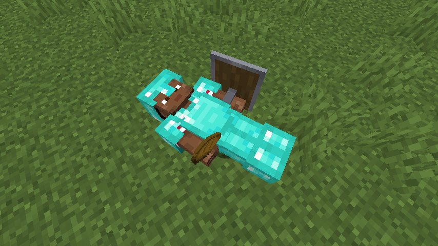

# Corpse Fabric Continuation

[](https://github.com/Fatin-Ishraq/corpse-fabric/actions/workflows/build.yml)
[](https://www.curseforge.com/minecraft/mc-mods/corpse-fabric-continuation/)

This repository provides an independent Fabric implementation of [Corpse](https://www.curseforge.com/minecraft/mc-mods/corpse) by [Max Henkel](https://github.com/henkelmax).

It stores a player's inventory in a corpse after death, keeps the original slot layout, renders the player's equipment, and provides a persistent death history.

> This is a community-maintained Fabric port. It is not currently an official release by Max Henkel.



## Downloads and links

- [Download on CurseForge](https://www.curseforge.com/minecraft/mc-mods/corpse-fabric-continuation/)
- [Original Corpse project](https://www.curseforge.com/minecraft/mc-mods/corpse)
- [Original Corpse source repository](https://github.com/henkelmax/corpse)
- [Report an issue](https://github.com/Fatin-Ishraq/corpse-fabric/issues)

## Features

- Stores the hotbar, main inventory, armor, and offhand items in the corpse.
- Preserves original inventory slots when transferring items back.
- Displays the player's skin, armor, selected item, and offhand item.
- Honors `keepInventory` and Curse of Vanishing.
- Protects corpses by owner, with operator bypass and configurable skeleton access.
- Prevents fire, lava, void, and distance-despawn item loss.
- Turns old corpses into skeletons after one hour by default.
- Opens the corpse inventory by right-clicking it.
- Opens death history with `U` or `/deathhistory`.
- Allows operators to use `/deathhistory <player>`.
- Supports client and dedicated-server environments.

## Supported versions

| Branch | Minecraft | Mod version | Java |
| --- | --- | --- | --- |
| [`1.20.1`](../../tree/1.20.1) | 1.20.1 | `0.1.3+1.20.1` | 17 |
| [`1.21.1`](../../tree/1.21.1) | 1.21.1 | `0.1.1+1.21.1` | 21 |
| [`1.21.4`](../../tree/1.21.4) | 1.21.4 | `0.1.2+1.21.4` | 21 |
| [`26.1.2`](../../tree/26.1.2) | 26.1.2 | `0.1.1+26.1.2` | 25 |
| [`26.2`](../../tree/26.2) | 26.2 | `0.1.1+26.2` | 25 |

Use the JAR made for your exact Minecraft version.

## Installation

Install:

1. Fabric Loader
2. Fabric API for your Minecraft version
3. The matching Corpse Fabric JAR

For multiplayer, install the mod and Fabric API on both the server and every connecting client.

## Configuration

The first launch creates `config/corpse.json`:

```json
{
  "ownerOnlyAccess": true,
  "skeletonAccessibleByEveryone": true,
  "emptyDespawnTicks": 600,
  "fullDespawnTicks": -1,
  "skeletonTicks": 72000,
  "maxHistoryEntriesPerPlayer": 50,
  "spawnFaceDown": false
}
```

A despawn value of `-1` disables that despawn rule. Restart the game or server after editing the file.

## Building

Check out the branch for the Minecraft version you want. Use Java 21 to build the 1.20.1, 1.21.1, and 1.21.4 branches; use Java 25 to build the 26.x branches. The Java column above is the minimum version required to run each mod JAR.

```powershell
.\gradlew.bat build
```

The distributable JAR is written to `build/libs`. The build also runs the Fabric GameTest suite.

To launch a development client:

```powershell
.\gradlew.bat runClient
```

## Upstream adoption

This port was implemented independently for Fabric. No Java source, textures, icons, or other assets from the original repository are bundled in the mod JAR.

Each supported Minecraft version has its own self-contained branch, Gradle wrapper, automated GameTests, client/server source separation, and release metadata. The repository is ready to be reviewed, contributed, transferred, or adapted into the official Corpse project.

Max, if you would like to adopt the Fabric port, I would be happy to contribute the code, transfer maintenance, and provide the permissions needed for an official release.

## License

All Rights Reserved. This applies to the independent Fabric implementation in this repository. Additional permission can be granted directly for upstream adoption.